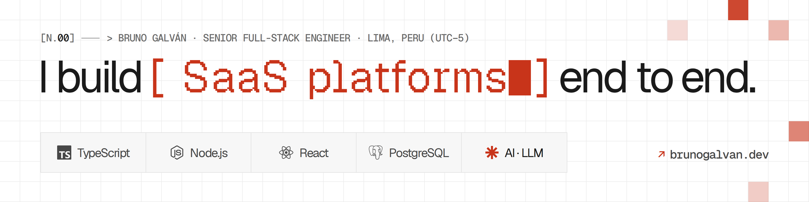

<picture>
  <source media="(prefers-color-scheme: dark)" srcset="assets/header-dark.png">
  
</picture>

### Senior Full-Stack Engineer

I build multi-tenant SaaS platforms from architecture to production, for healthcare, retail, education and ERP. Remote from Lima, Peru (UTC−5).

#### What I work on

- **Platform engineering.** TypeScript and Node.js backends with DDD and hexagonal architecture, contract-first APIs and React interfaces, shipped with automated tests and continuous integration.
- **Business-critical systems.** Billing and payments under tax regulations, scheduling and clinical records, where the rules are complex and the numbers always have to match.
- **Data migration at scale.** Clinics moved from multiple platforms and backups (MySQL, Firebird, SQL Server and closed systems): more than 2 million records, validated with automated checks.
- **Production performance.** PostgreSQL tuned from real metrics: query rewrites, indexing and autovacuum.
- **AI in production.** Conversational agents with tool calling, CRM-connected assistants and LLM process automation, built for reliable answers.

#### Now

- **ClinicSay**, Senior Full-Stack Engineer. A clinic-management SaaS used by more than 20 clinics in Spain. I own billing and payments, scheduling and data migration, and have written over a third of the new backend.
- **Asistira**, founder. A multi-tenant SaaS for service businesses, in development with Nx, Fastify, Next.js and PostgreSQL.

#### In the open

- [**brunogalvan.dev**](https://github.com/bgalvandev/brunogalvan.dev): my site. Static Astro in two languages, a Content Security Policy built from hashes, accessibility checks in both themes and Playwright on every change. [Read the case study](https://brunogalvan.dev/en/projects/brunogalvan-dev/).
- Decisions written down as ADRs: [hosting on Cloudflare Pages](https://github.com/bgalvandev/brunogalvan.dev/blob/main/docs/adr/0007-hosting-on-cloudflare-pages.md), [one canonical domain](https://github.com/bgalvandev/brunogalvan.dev/blob/main/docs/adr/0012-domains.md), [motion with bundled GSAP](https://github.com/bgalvandev/brunogalvan.dev/blob/main/docs/adr/0008-motion-with-bundled-gsap.md) and [hinted static fonts](https://github.com/bgalvandev/brunogalvan.dev/blob/main/docs/adr/0013-hinted-static-geist.md).

Most of my professional work lives in private company repositories; the contribution graph below includes it.

<samp><a href="https://brunogalvan.dev">brunogalvan.dev</a> · <a href="https://www.linkedin.com/in/bgalvandev">linkedin.com/in/bgalvandev</a> · <a href="mailto:brunogalvangarcia@gmail.com">brunogalvangarcia@gmail.com</a></samp>
